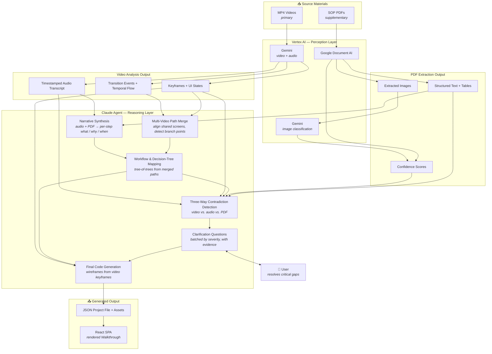

# Walkthrough — Data Flow

```mermaid
flowchart TD
    subgraph Input["📥 Source Materials"]
        MP4["MP4 Videos<br/><i>primary</i>"]
        PDF["SOP PDFs<br/><i>supplementary</i>"]
    end

    subgraph Perception["Vertex AI — Perception Layer"]
        Gemini_Video["Gemini<br/><i>video + audio</i>"]
        DocAI["Google Document AI"]
        Gemini_Images["Gemini<br/><i>image classification</i>"]
    end

    subgraph Gemini_Video_Out["Video Analysis Output"]
        Keyframes["Keyframes + UI States"]
        Transitions["Transition Events + Temporal Flow"]
        Transcript["Timestamped Audio Transcript"]
    end

    subgraph DocAI_Out["PDF Extraction Output"]
        Text["Structured Text + Tables"]
        Images["Extracted Images"]
        Confidence["Confidence Scores"]
    end

    subgraph Claude["Claude Agent — Reasoning Layer"]
        Merge["Multi-Video Path Merge<br/><i>align shared screens, detect branch points</i>"]
        Narrative["Narrative Synthesis<br/><i>audio + PDF → per-step what / why / when</i>"]
        Workflow["Workflow &amp; Decision-Tree Mapping<br/><i>tree-of-trees from merged paths</i>"]
        Contradict["Three-Way Contradiction Detection<br/><i>video vs. audio vs. PDF</i>"]
        Clarify["Clarification Questions<br/><i>batched by severity, with evidence</i>"]
        Generate["Final Code Generation<br/><i>wireframes from video keyframes</i>"]
    end

    User["👤 User<br/><i>resolves critical gaps</i>"]

    subgraph Output["📤 Generated Output"]
        JSON["JSON Project File + Assets"]
        SPA["React SPA<br/><i>rendered Walkthrough</i>"]
    end

    MP4 --> Gemini_Video
    PDF --> DocAI

    Gemini_Video --> Keyframes
    Gemini_Video --> Transitions
    Gemini_Video --> Transcript

    DocAI --> Text
    DocAI --> Images
    DocAI --> Confidence
    Images --> Gemini_Images
    Gemini_Images --> Confidence

    Keyframes --> Merge
    Transitions --> Merge
    Transcript --> Narrative
    Text --> Narrative
    Text --> Contradict
    Confidence --> Contradict

    Merge --> Workflow
    Narrative --> Workflow
    Workflow --> Contradict

    Keyframes --> Contradict
    Transcript --> Contradict

    Contradict --> Clarify
    Clarify <--> User
    Clarify --> Generate

    Workflow --> Generate
    Keyframes --> Generate

    Generate --> JSON
    JSON --> SPA
```
